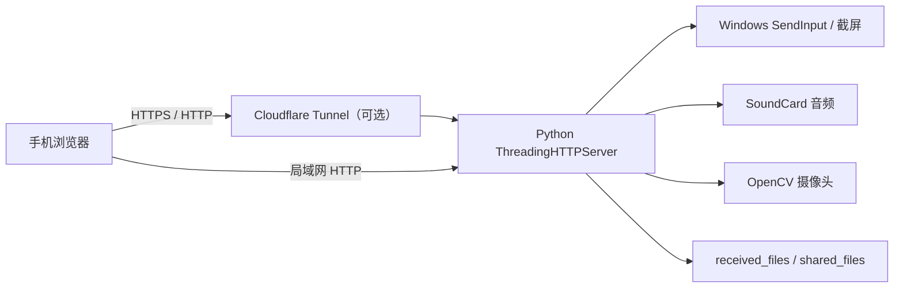

# 架构说明

**简体中文** · [English](en/ARCHITECTURE.md)

## 服务端

`server.py` 使用 Python 标准库 HTTP 服务处理鉴权、静态页面和控制 API：

- `/api/status`：连接状态和屏幕尺寸
- `/api/screen.jpg`：屏幕 JPEG
- `/api/input`：鼠标、键盘和文字输入
- `/api/audio.wav`：电脑声音或麦克风 WAV 分片
- `/api/camera.jpg`：摄像头 JPEG
- `/api/phone-mic`：手机 PCM 音频播放队列
- `/api/files`：共享文件列表和传输

音频和摄像头采用按需启动、后台持续采集的方式。所有控制和媒体 API 均校验随机 token。

## 手机端

`web/index.html` 是无构建步骤的单文件界面，使用 Pointer Events、Fetch、Web Audio 和 MediaDevices API。

## 外网模式

外网模式下 Python 服务只监听 `127.0.0.1`，`cloudflared` 建立随机 `trycloudflare.com` HTTPS 隧道。路由器无需开放入站端口。

Quick Tunnel 适合临时个人使用，不提供固定域名、访问策略或可用性保证。长期部署应改用受管 Cloudflare Tunnel、Tailscale 或自建认证中继。
