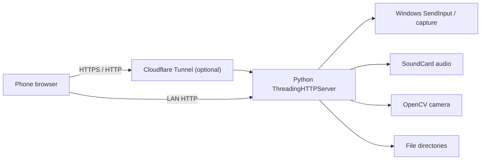

# Architecture

[简体中文](../ARCHITECTURE.md) · **English**

## Server

`server.py` serves the web UI, validates the random token, captures the display, injects Windows input, and manages continuous audio/camera workers.

## Browser Client

`web/index.html` is a build-free client using Pointer Events, Fetch, Web Audio, and MediaDevices.

## Internet Mode

The Python server binds only to `127.0.0.1`. Cloudflared creates a random HTTPS `trycloudflare.com` tunnel, so no router port forwarding is required.

Quick Tunnel is intended for temporary personal use. A managed tunnel, Tailscale, or an authenticated relay is more appropriate for long-term deployment.
